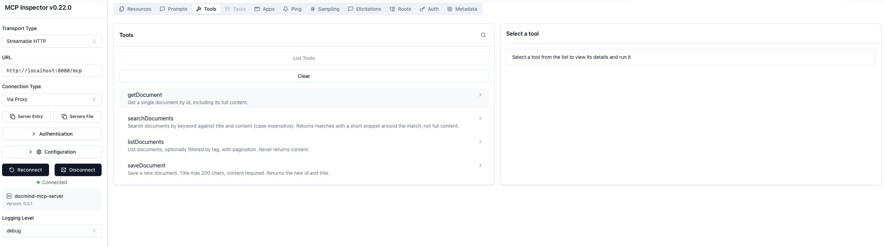
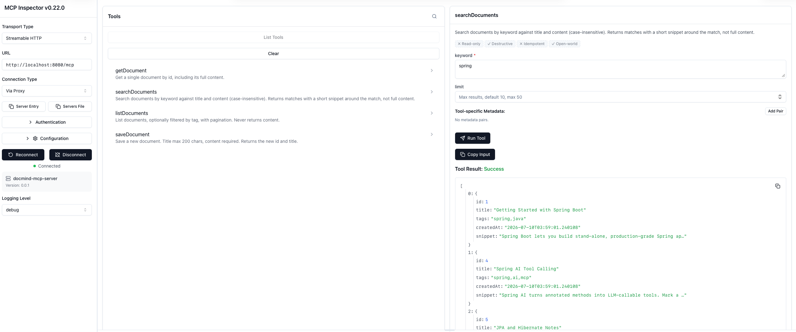
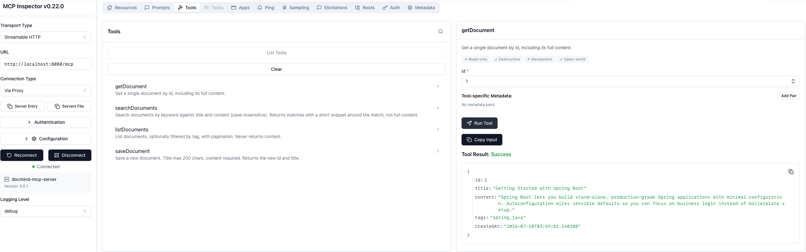
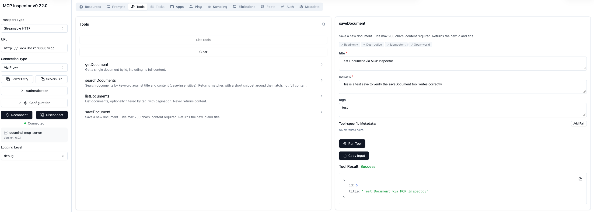
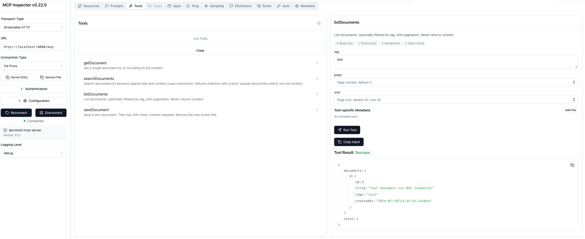
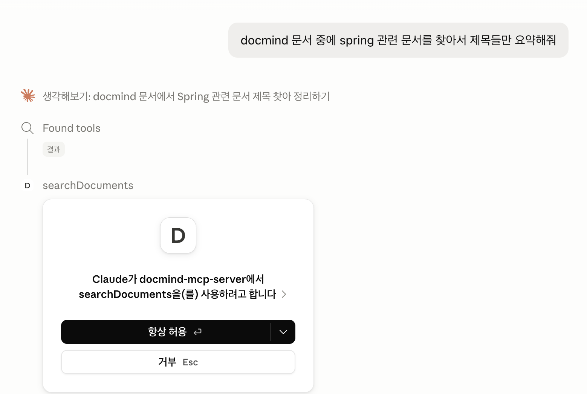
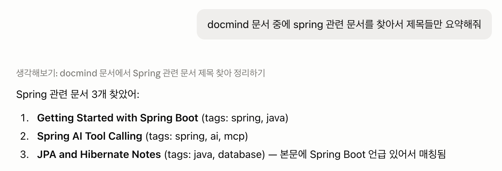

# docmind-mcp-server


문서 관리/검색 기능을 Streamable HTTP 기반 MCP 툴로 제공하는 서버.
`docmind-rag`(별도 저장소, Spring AI 기반 RAG 서비스)가 에이전트 툴로 호출한다.

## 목차
1. [주요 기능](#주요-기능)
2. [아키텍처](#아키텍처)
3. [기술 스택](#기술-스택)
4. [설치 및 실행](#설치-및-실행)
5. [데모 데이터](#데모-데이터)
6. [툴](#툴)
7. [실행 예시](#실행-예시)
8. [명령어](#명령어)

## 주요 기능
- 키워드 기반 문서 검색 (제목/본문, 스니펫 반환)
- id로 문서 전체 조회
- 태그 필터링 문서 목록 조회
- 신규 문서 저장
- Streamable HTTP 기반 MCP 프로토콜로 외부 에이전트(`docmind-rag`, Claude Desktop 등)와 연동

## 아키텍처
```
docmind-rag (MCP client, separate repo)
        │  Streamable HTTP (MCP protocol)
        ▼
docmind-mcp-server (this repo)
        │  JPA
        ▼
PostgreSQL (document metadata + content)
```

## 기술 스택
- Java 21, Spring Boot 3.5.16, Gradle (Groovy)
- Spring AI 1.1.8 — `spring-ai-starter-mcp-server-webmvc`
- PostgreSQL, Spring Data JPA, Lombok

## 설치 및 실행

사전 요구사항: JDK 21, Docker.

1. 환경변수 템플릿 복사:
   ```bash
   cp .env.example .env
   ```
2. `src/main/resources/application-local.yml` 생성 (gitignore 처리됨, 커밋되지 않음):
   ```yaml
   spring:
     datasource:
       url: jdbc:postgresql://localhost:5432/docmind
       username: docmind
       password: docmind  # local dev only
   ```
3. Postgres 실행:
   ```bash
   docker compose up -d
   ```
4. 서버 실행:
   ```bash
   ./gradlew bootRun
   ```

MCP 엔드포인트: `http://localhost:8080/mcp` — 모든 요청에 `X-API-Key` 헤더 필요
(`.env`/`application.yml`의 `docmind.mcp.api-key` 참고, 로컬 개발 기본값은 `local-dev-api-key`).
MCP Inspector 등 외부 클라이언트로 접속할 때는 커스텀 헤더 설정에 이 값을 추가해야 한다.

## 데모 데이터
샘플 문서 데이터를 시드 (앱을 한 번 부팅해서 스키마가 생성된 이후에 실행):
```bash
docker compose exec -T postgres psql -U docmind -d docmind < scripts/seed.sql
```
재실행 가능 — 항상 동일한 상태로 초기화된다. 자세한 내용은 `scripts/seed.sql` 참고.

## 툴
| 도구 | 파라미터 | 설명 |
|------|--------|--------------|
| `searchDocuments` | `keyword` (필수), `limit` (기본값 10, 최대 50) | 제목/본문 키워드 검색, 스니펫 반환 |
| `getDocument` | `id` (필수) | id로 문서 전체 조회 |
| `listDocuments` | `tag` (선택), `page` (기본값 0), `size` (기본값 20, 최대 50) | 문서 목록 조회, 태그로 필터링 가능; 본문은 반환하지 않음 |
| `saveDocument` | `title`, `content` (필수), `tags` (선택) | 새 문서 저장 |

전체 스펙: `docs/PLANNING.md`.

## 실행 예시

MCP Inspector로 4개 tool을 실제 서버에 연결해 검증한 화면.

**Tool 목록** — 서버가 광고하는 4개 tool


**searchDocuments** — "spring" 키워드로 제목/본문 검색, snippet 반환


**getDocument** — id로 문서 전체 content 조회


**saveDocument** — 새 문서 저장 (id/title 반환)


**listDocuments** — 태그 필터링, content는 반환하지 않음


**Claude Desktop 연동** — 실제 클라이언트가 자연어 요청을 받아 MCP tool을 호출하는 전체 흐름

"docmind 문서 중에 spring 관련 문서를 찾아서 제목들만 요약해줘"라고 요청하면:

1. Claude가 `searchDocuments` 호출을 제안하고 승인을 요청
   
2. 승인 후 tool 결과를 받아 자연어로 정리한 답변
   

## 명령어
```bash
./gradlew bootRun   # run server
./gradlew test      # run tests
./gradlew build     # full build
```
